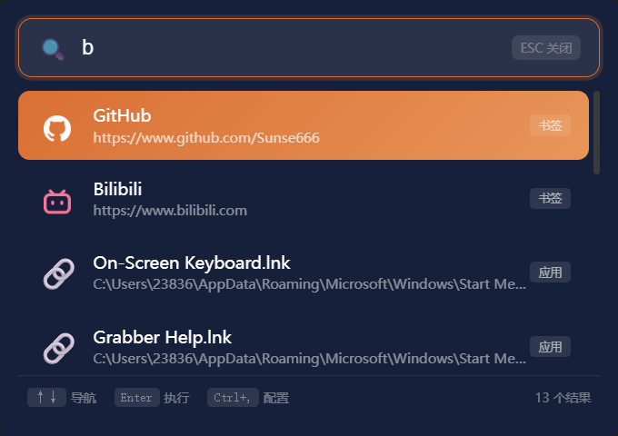

# Quera

  

 <strong>用于快捷启动</strong> 

   

## ✨ 简介
- 基于 WebView2 的 Windows 快速启动器，追求极致的轻量与高效，通过全局热键一键唤出，快速搜索并启动应用、文件、命令、书签，提升工作效率。

## 🖼️ 截图

  

## 🚀 功能特性

### 🔍 全局搜索
- 一键搜索应用程序、文件、文件夹
- 自动索引开始菜单程序与自定义目录
- 支持模糊匹配，快速定位目标

### ⚡ 自定义命令
- 创建自定义快捷命令
- 支持 Shell、CMD、PowerShell 多种执行方式
- 可配置管理员权限运行

### 🔗 书签管理
- 快速访问常用网页书签
- 关键词触发，一键直达

### 🌐 搜索引擎集成
- 输入 关键词 + 空格 + 搜索词 直接搜索
- 支持自定义多个搜索引擎

### 📁 文件夹快捷方式
- 配置常用文件夹快捷入口
- 关键词快速打开目标目录

### ⌨️ 快捷键操作

> [!TIP]
> |快捷键|功能|
> |---|---|
> |Alt + Space|唤出/隐藏窗口|
> |↑ ↓|	选择导航结果|
> |Enter|执行选中项|
> |Tab|展开搜索引擎|
> |Esc|	隐藏窗口|
> |Ctrl + ,|打开配置文件|
> |Ctrl + R|重新加载配置|
